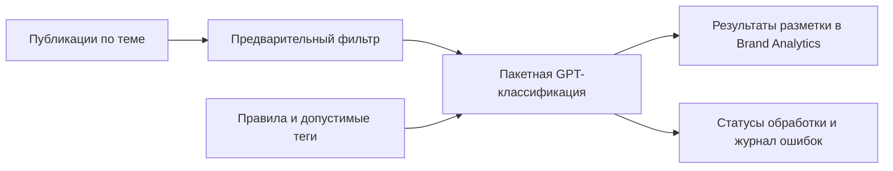
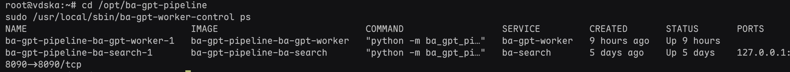
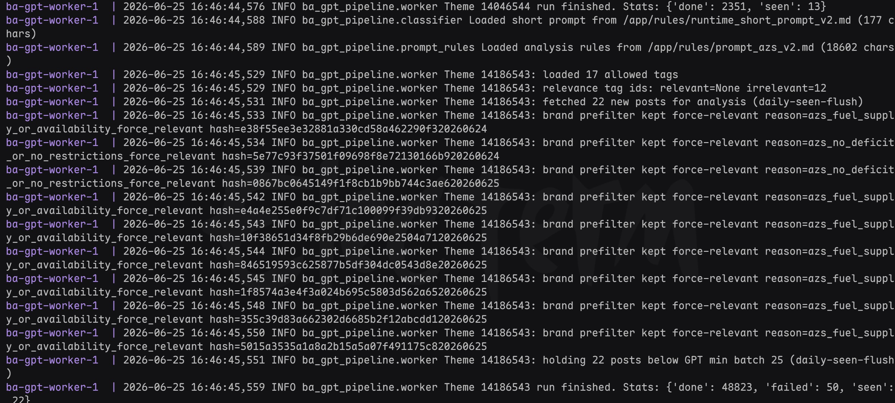
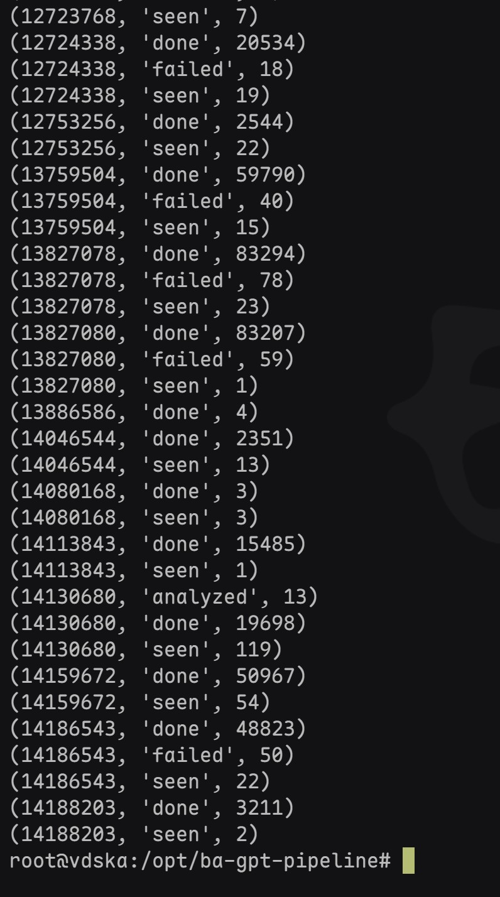

# BA AI Monitoring Agent

AI-пайплайн для обработки тематических публикаций и разметки материалов в Brand Analytics. Публичный репозиторий содержит демонстрационные материалы проекта.

## Задача

Автоматизировать предварительный отбор и классификацию публикаций по заданным темам и брендам, чтобы аналитик мог работать с размеченными материалами. На опубликованном примере показана тематика АЗС и топлива.

## Архитектура

В логах видны загрузка правил и допустимых тегов, предварительная фильтрация по брендам, накопление пакета перед GPT-обработкой и учёт статусов. Скриншот окружения показывает отдельные сервисы worker и search, запущенные в контейнерах.

## Стек

- Python: обработчик публикаций, предварительная фильтрация и классификация.
- GPT: классификация с тематическими правилами; конкретная модель в материалах не указана.
- Docker Compose: запуск сервисов worker и search.
- Brand Analytics: интерфейс просмотра размеченных публикаций.

## Результат

Скриншоты показывают запущенные сервисы, логи обработки, статистику очереди и пример публикации с тематическими тегами в Brand Analytics.

В статистике одной темы зафиксировано **83 294 записи со статусом `done`**. Это счётчик обработанных записей на момент снимка, а не оценка точности классификатора, скорости обработки или экономии времени. В очереди также есть записи со статусом `failed`.

## Демонстрация

### Работа сервисов

### Логи обработки

### Статистика очереди

### Пример разметки

## Состав публичного репозитория

| Файлы | Содержимое |
| --- | --- |
| `01_worker_status.jpg`, `02_worker_logs.jpg`, `03_queue_stats.jpg` | Скриншоты окружения, логов и статистики |
| `04_brand_analytics_result.png` | Пример разметки публикации |
| `demo_classifier.py`, `demo_prefilter.py`, `demo_search.py` | JPEG-копии первых трёх скриншотов с ошибочным расширением; это не Python-модули |
| `project.pdf` | Текстовый Python-пример предварительного фильтра; это не PDF-документ |

## Запуск и ограничения

Полный исходный код, зависимости и конфигурация подключения в этой публичной версии отсутствуют, поэтому запустить весь сервис из репозитория нельзя. Файлы с ошибочными расширениями перечислены выше, чтобы их содержимое не воспринималось как исполняемый код или документация PDF.

Метрики точности, полноты классификации и эффекта для бизнеса в опубликованных материалах не приведены. Для их проверки необходима размеченная выборка и сравнение результатов системы с оценками аналитика.
